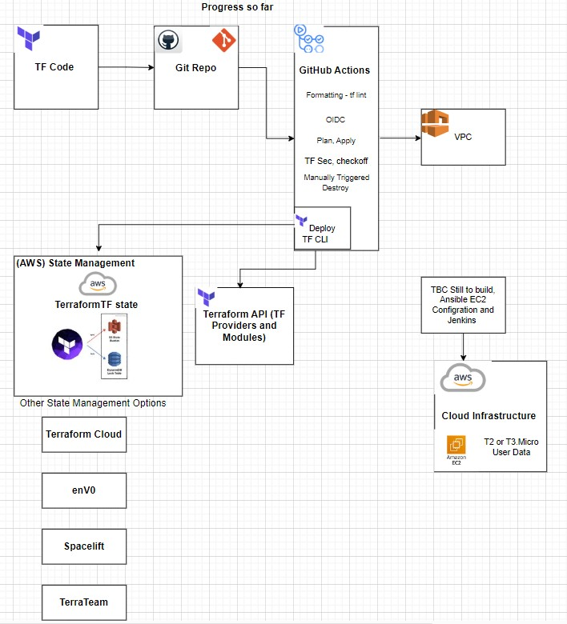

# DevOps-TerrAnsible-Jenkins

## Overview

This repository is a hands-on project designed as a personal learning experience to grow my automation skills. It integrates Terraform, Ansible, and Jenkins to deploy and manage cloud infrastructure efficiently, covering automated CI/CD pipeline setup, Infrastructure as Code (IaC) for cloud resource management, and leveraging automation tools for configuration management.



## Features

- **Infrastructure as Code** with Terraform
- **Configuration Management** using Ansible
- **CI/CD Automation** with Jenkins
- **OIDC Authentication** for AWS access via GitHub Actions
- **GitHub Actions Workflows** for automated deployments
- **Terraform State Management** with AWS S3 and DynamoDB

## Technologies Used

- **Terraform** - Infrastructure provisioning
- **Ansible** - Configuration management
- **Jenkins** - CI/CD pipeline automation
- **AWS** - Cloud infrastructure provider
- **GitHub Actions** - Automated workflows
- **Gitpod & GitHub Codespaces** - Cloud development environments

## Table of Contents

- [GitHub Codespaces vs Gitpod](#github-codespaces-vs-gitpod)
- [Installing and Configuring Terraform](#installing-and-configuring-terraform)
- [Setting Up Terraform Project](#setting-up-terraform-project)
- [Using CloudFormation for OIDC Authentication](#using-cloudformation-for-oidc-authentication)
- [Setting Up GitHub Actions](#setting-up-github-actions)
- [Semantic Versioning](#semantic-versioning)
- [Useful Git Commands](#useful-git-commands)
- [Terraform State Management](#terraform-state-management)
- [Terraform State Information](#terraform-state-information)
  - [Viewing Items in Your State](#terraform-viewing-items-in-your-state)
  - [terraform show](#terraform-show)
  - [terraform state list](#terraform-state-list)
  - [grep Filtering](#filter-with-grep)
- [Adding Variables to Make a Deployment More Dynamic](#adding-variables-to-make-a-deployment-more-dynamic)
- [Random Provider](#random-provider)
- [Reference Documentation](#reference-documentation)

## GitHub Codespaces vs Gitpod

Using **GitHub Codespaces** over **Gitpod** provides several advantages:

- **Built-in Terraform Support**: Terraform can be installed and used immediately.
- **Better Secret Management**: GitHub Codespaces instantly highlights potential secret exposure issues, unlike Gitpod.
- **VS Code Integration**: Gitpod uses a third-party VS Code variant, while Codespaces provides the full experience.
- **Faster Environment Setup**: In Gitpod, you may need to create a `bin` directory to manually configure the environment, which can slow down project setup.

## Installing and Configuring Terraform

To install Terraform, follow the official [Terraform installation guide](https://developer.hashicorp.com/terraform/install).

```bash
wget -O - https://apt.releases.hashicorp.com/gpg | sudo gpg --dearmor -o /usr/share/keyrings/hashicorp-archive-keyring.gpg
echo "deb [arch=$(dpkg --print-architecture) signed-by=/usr/share/keyrings/hashicorp-archive-keyring.gpg] https://apt.releases.hashicorp.com $(lsb_release -cs) main" | 
sudo tee /etc/apt/sources.list.d/hashicorp.list
sudo apt update && sudo apt install terraform
```

## Setting Up Terraform Project

1. Create a directory for your Terraform files (e.g., `mtc-terransible`).
2. Inside the directory, create:
   - `providers.tf`
   - `main.tf`
3. Run `terraform init`.
4. **Versioning Consideration**: You don't have to specify the Terraform version in providers.tf. After initialization, a .terraform.lock.hcl file is created, where the locked version can be referenced. If you wish to lock in the latest version within the provider block, you can find the exact version inside this lock file, as documentation versions can sometimes be slightly out of date.

## Using CloudFormation for OIDC Authentication

To configure AWS OIDC role access, use a **CloudFormation template**. [Reference documentation](https://docs.aws.amazon.com/IAM/latest/UserGuide/id_roles_providers_create_oidc.html).

## Setting Up GitHub Actions

1. Create a directory structure:
   ```plaintext
   .github/workflows/
   ```
2. Inside `.github/workflows/`, create your workflow YAML files:
   - `plan.yml`: Runs on every pull request to the `main` branch.
   - `apply.yml`: To be added for applying infrastructure changes.

## Semantic Versioning

Semantic Versioning (SemVer) is a versioning convention that follows the format **MAJOR.MINOR.PATCH**:

- **MAJOR**: Incompatible API changes
- **MINOR**: New functionality added in a backward-compatible manner
- **PATCH**: Backward-compatible bug fixes

Example:
- `v1.0.0`: Initial stable release
- `v1.1.0`: New features added, but backward-compatible
- `v1.1.1`: Bug fixes with no functional changes

[More details on Semantic Versioning](https://semver.org/).

## Useful Git Commands

### Deleting a Tag
```bash
git tag -d <tag-name>
git push origin --delete <tag-name>
```

### Checking Out a Branch
```bash
git checkout <branch-name>
```

### Creating and Switching to a New Branch
```bash
git checkout -b <new-branch>
```

### Merging a Branch into Main
```bash
git checkout main
git merge <branch-name>
```

## Reference Documentation

### Terraform

- [Terraform Installation](https://developer.hashicorp.com/terraform/install)
- [Terraform AWS Provider](https://registry.terraform.io/providers/hashicorp/aws/latest/docs)
- [Terraform Best Practices](https://developer.hashicorp.com/terraform/tutorials)
- [GitHub Terraform Action](https://github.com/hashicorp/setup-terraform)

### GitHub Actions

- [GitHub Actions Starter Workflows](https://github.com/actions/starter-workflows)

## Future Enhancements

- Implement Terraform modules for modular infrastructure
- automate the the initialisation, plan and apply phases through workflow actions.

## add terraform fmt -recursive
## terraform validate 

add a piece on in line comments # this is an inline comment 
terraform prefers block comments 

add terraform fmt -recursive

## Terraform State Management

Add a piece on Terraform state management including deleting items from DynamoDB if previous locks have been created incorrectly — state conflict happens.

## Terraform State Information

### Terraform: Viewing Items in Your State

```bash
terraform show -json | jq
```

Without anything deployed:

```json
{ "format_version": "0.2" }
```

Only version format will be returned.

Once `terraform apply` is run and resources are deployed, if you run:

```bash
terraform show -json | jq
```

again, this time you're returned the state displaying the resources deployed.

### `terraform show`

Shows state in an easy-to-read kind of way.

### `terraform state list`

```bash
terraform state list
```

Example output:

```
aws_vpc.mtc_vpc
```

What resources have been deployed without extra info.

### Filter with `grep`

```bash
terraform show | grep cidr_block
```

Example output:

```bash
assign_generated_ipv6_cidr_block = false
cidr_block = 10.123.0.0/16
```

## Adding Variables to Make a Deployment More Dynamic

Variables in multiple languages just hold values you want to use in multiple places.

Dots, slashes, and numbers are interpreted as strings:

```bash
"./12" = "string"
```

### Basic Variable

```bash
variable "vpc_cidr" {}
```

You will be asked to provide the CIDR upon deployment when running `terraform apply`.

### With Type Specified

```bash
variable "vpc_cidr" {
  type = string
}
```

This is a nicer way of putting it. Then you can use a dev or prod `.tfvars` file where you can specify the CIDR value.

If you are using multiple `.tfvars`, you can specify the default value in the main `variables.tf`:

```bash
variable "vpc_cidr" {
  type    = string
  default = "10.2.0.0/16"
}
```

Specifying the CIDR in a `.tfvars` file looks like:

```bash
vpc_cidr = "10.2.0.0/16"
```

Obviously, the default will be removed from the main `variables.tf`.

## Random Provider

Random is another provider — you need to run:

```bash
terraform init
```

There’s some great stuff in the documentation, where you can generate or create a resource with a random ID, let's say.

Using the `random_id` resource, you could generate resources and differentiate between them based on which VPC they are deployed in.

You'll find this used a lot when working with EC2, load balancers, etc., where you will need random IDs.

### Example Resource

```bash
resource "random_id" "random" {
  byte_length = 2
}
```

- `byte_length = 1` = 8 bits of randomness

Once assigned, you can use the output in most things that require random/unique IDs. For example, with tags:

```bash
name = "mtc_vpc-${random_id.random.dec}"
name = "mtc_igw-${random_id.random.dec}"
```
[Random Provider Documentation](https://registry.terraform.io/providers/hashicorp/random/latest/docs/resources/id)

## License

This project is licensed under the MIT License.


